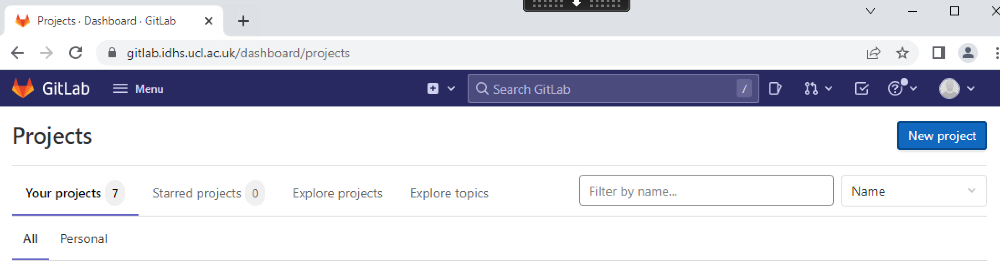
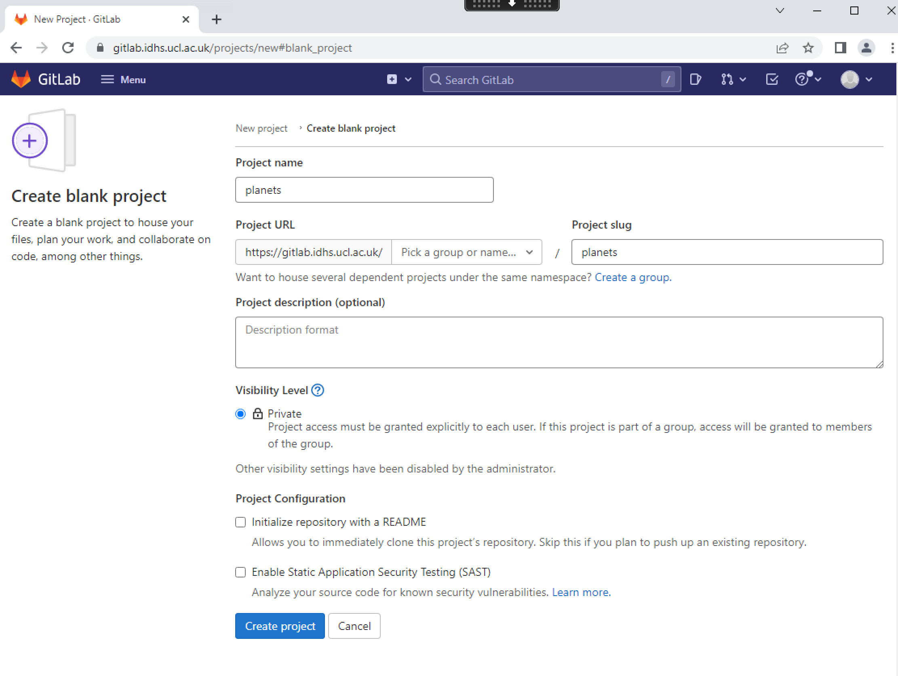
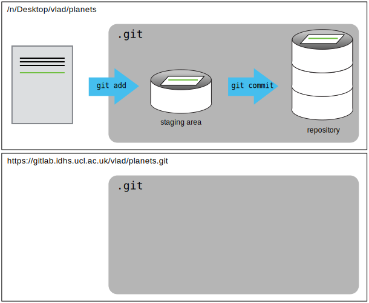
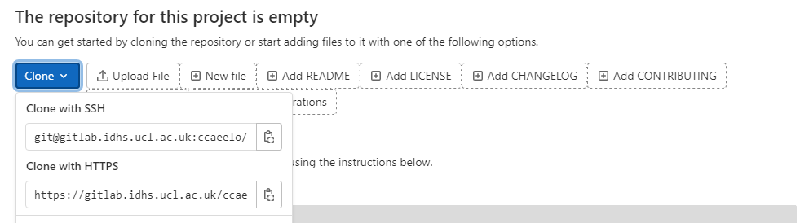
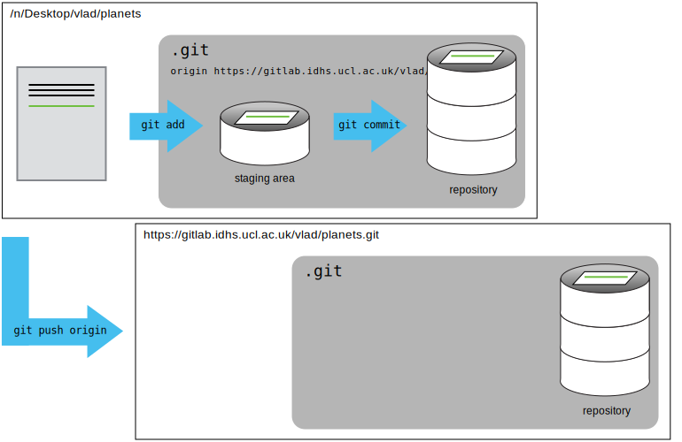

Version control really comes into its own when we begin to collaborate with
other people.  We already have most of the machinery we need to do this; the
only thing missing is to copy changes from one repository to another.

Systems like Git allow us to move work between any two repositories.  In
practice, though, it's easiest to use one copy as a central hub, and to keep it
on the web rather than on someone's laptop.  Most programmers use hosting
services like [GitHub](https://github.com), [Bitbucket](https://bitbucket.org) or
[GitLab](https://gitlab.com/) to hold those main copies; we'll explore the pros
and cons of this in a later episode.

> ## Sensitive data and Git
> In the DSH, there is an instance of GitLab that we can use as our central hub and share our work 
> with anyone else who has a DSH account. 
> Although any kind of file can be tracked with Git and stored on the DSH GitLab servers, 
> it is very important not to commit sensitive data files to Git to avoid an accidental 
> data breach when sharing code. If sensitive data has been committed to Git, it is difficult
> to undo but not impossible - please get in touch with the DSH support team if you need help. 
>
> Prevention is of course better than cure, and it may be a good option to use `.gitignore` to 
> ensure that none of your source data is tracked by Git (see [previous episode](../06-ignore/)), 
> or simply to keep your data in a separate directory from the code you are tracking, one level higher up
> in the directory tree, and access it programmatically using the double-dot 
> notation in filepaths, e.g. `../data/participants.csv`. 
{: .callout}

Back to our example, let's start by uploading the changes we've made to the DSH GitLab instance. 
To this end we are going to create a *remote* repository that will be linked to our *local* repository.

## 1. Create a remote repository
Open up GitLab in the DSH by clicking on the link in the Start menu, and log in using your regular DSH 
credentials, then click on the icon in the top right corner to create a new project:



Click "Create blank project" then name it "planets" on the next screen. The dropdown list saying "Pick
a group or name..." enables you to store a new project either in your own space on GitLab or your team's. 
For collaborative projects it will usually be preferable to use your team's space, which is 
identified by a 5-digit information governance case reference number ("Caseref"). For this example, selecting 
our usernames from the dropdown will be fine. 

GitLab defaults to initializing a new project with a README file; in some scenarios this may be useful
but because we will be connecting this repository to an existing local repository, it makes life easier if it is empty.
A more detailed explanation of why this is true will follow at the end of this episode.  

Once you've added the project name, selected your username from the dropdown, and unchecked the README box, 
then you're ready to click "Create project".



We have effectively done the following on GitLab's server:

~~~
$ mkdir planets
$ cd planets
$ git init
~~~
{: .language-bash}

If you remember back to the earlier [episode](../04-changes/) where we added and
committed our earlier work on `mars.txt`, we had a diagram of the local repository
which looked like this:


Now that we have two repositories, we need a diagram like this:



Note that our local repository still contains our earlier work on `mars.txt`, but the
remote repository on GitHub appears empty as it doesn't contain any files yet.

## 2. Connect local to remote repository
Now we connect the two repositories.  We do this by making the
GitLab repository a [remote]({{ page.root}}#remote) for the local repository.
The new project page for the repository on GitLab includes the URL string we need to
identify it under the "Clone" dropdown button:



We'll be using the "SSH" [protocol]({{ page.root }}#protocol), so click on the 
clipboard icon next to "Clone with SSH" to copy the SSH url.

> ## HTTPS vs. SSH
>
> We use SSH here because, while it requires some additional configuration, it is a 
> security protocol widely used by many applications.  The steps below describe SSH at a 
> minimum level for GitLab. A supplemental episode to this lesson discusses advanced setup 
> and concepts of SSH and key pairs, and other material supplemental to git related SSH. 
{: .callout}

Once you've copied that URL, go back to Git Bash and your local `planets` repository, and run
this command (you may find it helpful to hold down <kbd>Shift</kbd> and right click to paste into Git Bash):

~~~
$ git remote add origin git@gitlab.idhs.ucl.ac.uk:vlad/planets.git
~~~
{: .language-bash}

Make sure to use the URL for your repository rather than Vlad's: the only
difference should be your username instead of `vlad`.

`origin` is a local name used to refer to the remote repository. It could be called
anything, but `origin` is a convention that is often used by default in git
and GitLab, so it's helpful to stick with this unless there's a reason not to.

We can check that the command has worked by running `git remote -v`:

~~~
$ git remote -v
~~~
{: .language-bash}

~~~
origin   git@gitlab.idhs.ucl.ac.uk:vlad/planets.git (fetch)
origin   git@gitlab.idhs.ucl.ac.uk:vlad/planets.git (push)
~~~
{: .output}

We'll discuss remotes in more detail in the next episode, while
talking about how they might be used for collaboration.

## 3. SSH Background and Setup
Before Dracula can connect to a remote repository, he needs to set up a way for his computer to authenticate with GitLab so it knows it’s him trying to connect to his remote repository. 

We are going to set up the method that is commonly used by many different services to authenticate access on the command line.  This method is called Secure Shell Protocol (SSH).  SSH is a cryptographic network protocol that allows secure communication between computers using an otherwise insecure network.  

SSH uses what is called a key pair. This is two keys that work together to validate access. One key is publicly known and called the public key, and the other key called the private key is kept private. Very descriptive names.

You can think of the public key as a padlock, and only you have the key (the private key) to open it. You use the public key where you want a secure method of communication, such as your GitLab account.  You give this padlock, or public key, to GitLab and say “lock the communications to my account with this so that only computers that have my private key can unlock communications and send git commands as my GitLab account.”  

What we will do now is the minimum required to set up the SSH keys and add the public key to a GitLab account.

> ## Advanced SSH
> A supplemental episode in this lesson discusses SSH and key pairs in more depth and detail. 
{: .callout}

The first thing we are going to do is check if this has already been done on the computer you’re on.  Because generally speaking, this setup only needs to happen once and then you can forget about it. 

> ## Keeping your keys secure
> You shouldn't really forget about your SSH keys, since they keep your account secure. It’s good 
>  practice to audit your secure shell keys every so often. Especially if you are using multiple 
>  computers to access your account.
{: .callout}

We will run the list command to check what key pairs already exist on your computer.

~~~
ls -al ~/.ssh
~~~
{: .language-bash}

Your output is going to look a little different depending on whether or not SSH has ever been set up on the computer you are using. 

Dracula has not set up SSH on his computer, so his output is 

~~~
ls: cannot access '/n//.ssh': No such file or directory
~~~
{: .output}

If SSH has been set up on the computer you're using, the public and private key pairs will be listed. The file names are either `id_ed25519`/`id_ed25519.pub` or `id_rsa`/`id_rsa.pub` depending on how the key pairs were set up.  
Since they don’t exist on Dracula’s computer, he uses this command to create them. 

### 3.1 Create an SSH key pair
To create an SSH key pair Vlad uses this command, where the `-t` option specifies which type of algorithm to use and `-C` attaches a comment to the key (here, Vlad's email):  

~~~
$ ssh-keygen -t ed25519 -C "vlad@tran.sylvan.ia"
~~~
{: .language-bash}

If you are using a legacy system that doesn't support the Ed25519 algorithm, use:
`$ ssh-keygen -t rsa -b 4096 -C "your_email@example.com"`

~~~
Generating public/private ed25519 key pair.
Enter file in which to save the key (/n//.ssh/id_ed25519):
~~~
{: .output}

We want to use the default file, so just press <kbd>Enter</kbd>.

~~~
Enter passphrase (empty for no passphrase):
~~~
{: .output}

Now, it is prompting Dracula for a passphrase.  Since he is using a secure connection 
to an ISO27001-certified system and plans to ensure that sensitive data is never 
committed to his Git history, he may regard this as overkill. If you do decide 
to set a passphrase, be sure to use something memorable or save your passphrase somewhere, 
as there is no "reset my password" option. 

After the passphrase step, we receive the confirmation

~~~
Your identification has been saved in /n//.ssh/id_ed25519
Your public key has been saved in /n//.ssh/id_ed25519.pub
The key fingerprint is:
SHA256:SMSPIStNyA00KPxuYu94KpZgRAYjgt9g4BA4kFy3g1o vlad@tran.sylvan.ia
The key's randomart image is:
+--[ED25519 256]--+
|^B== o.          |
|%*=.*.+          |
|+=.E =.+         |
| .=.+.o..        |
|....  . S        |
|.+ o             |
|+ =              |
|.o.o             |
|oo+.             |
+----[SHA256]-----+
~~~
{: .output}

The "identification" is actually the private key. You should never share it.  The public key is appropriately named.  The "key fingerprint" 
is a shorter version of a public key.

Now that we have worked through these steps, we will find the SSH files when we check.

~~~
ls -al ~/.ssh
~~~
{: .language-bash}

~~~
drwxr-xr-x 1 Vlad Dracula 197121   0 Jul 28 14:48 ./
drwxr-xr-x 1 Vlad Dracula 197121   0 Jul 28 14:48 ../
-rw-r--r-- 1 Vlad Dracula 197121 419 Jul 28 14:48 id_ed25519
-rw-r--r-- 1 Vlad Dracula 197121 106 Jul 28 14:48 id_ed25519.pub
~~~
{: .output}

### 3.2 Copy the public key to GitLab
Now we have a SSH key pair but before we can use it, we need to tell GitLab that it exists. 

First, we need to copy the public key.  Be sure to include the `.pub` at the end, otherwise you’re looking at the private key. 

~~~
cat ~/.ssh/id_ed25519.pub
~~~
{: .language-bash}

~~~
ssh-ed25519 AAAAC3NzaC1lZDI1NTE5AAAAIDmRA3d51X0uu9wXek559gfn6UFNF69yZjChyBIU2qKI vlad@tran.sylvan.ia
~~~
{: .output}

Select this text (from "ssh" at the start of the line up to and including your email address), then hold down <kbd>Shift</kbd> and right click to display a menu enabling you to copy the selected text to your clipboard. 

Now, going to the DSH GitLab in your browser, click on your profile icon in the top right corner to get the drop-down menu.  Click "Preferences," then on the 
settings page, click "SSH keys," on the left side "User settings" menu. Under "Add an SSH key", paste your SSH key into the 
"Key" text entry field, add a title below that (e.g. DSH Windows Desktop) and leave the "Expiration date" field blank. Click "Add key" to complete the setup.

Now that this is done, we can run this command to check our authentication from Git Bash. 
~~~
$ ssh -T git@github.com
~~~
{: .language-bash}

~~~
Welcome to GitLab, @Vlad!
~~~
{: .output}

Good! This output confirms that the SSH key works as intended. We are now ready to push our work to the remote repository.

## 4. Push local changes to a remote

Now that authentication is setup, we can return to the remote.  This command will push the changes from
our local repository to the repository on GitLab:

~~~
$ git push origin main
~~~
{: .language-bash}

If you set up a passphrase, it will prompt you for it. 

~~~
Enumerating objects: 16, done.
Counting objects: 100% (16/16), done.
Delta compression using up to 8 threads.
Compressing objects: 100% (11/11), done.
Writing objects: 100% (16/16), 1.45 KiB | 372.00 KiB/s, done.
Total 16 (delta 2), reused 0 (delta 0)
remote: Resolving deltas: 100% (2/2), done.
To https://gitlab.idhs.ucl.ac.uk:vlad/planets.git
 * [new branch]      main -> main
~~~
{: .output}

Our local and remote repositories are now in this state:



> ## The '-u' Flag
>
> You may see a `-u` option used with `git push` in some documentation.  This
> option is synonymous with the `--set-upstream-to` option for the `git branch`
> command, and is used to associate the current branch with a remote branch so
> that the `git pull` command can be used without any arguments. To do this,
> simply use `git push -u origin main` once the remote has been set up.
{: .callout}

We can pull changes from the remote repository to the local one as well:

~~~
$ git pull origin main
~~~
{: .language-bash}

~~~
From https://gitlab.idhs.ucl.ac.uk/vlad/planets.git
 * branch            main     -> FETCH_HEAD
Already up-to-date.
~~~
{: .output}

Pulling has no effect in this case because the two repositories are already
synchronized.  If someone else had pushed some changes to the repository on
GitHub, though, this command would download them to our local repository.

> ## GitLab GUI
>
> Browse to your `planets` repository on GitLab.
> Find and click the button that says "History".
> Hover over, and click on, the two buttons to the right of each commit.
> What information can you gather/explore from these buttons?
> How would you get that same information in the shell?
>
> > ## Solution
> > The button with the picture of a clipboard copies the full identifier of the commit. 
> > In Git Bash, ```git log``` will show you the full commit identifier for each 
> > commit. (The shortened commit identifier, which is made up of the first seven characters of 
> > full identifier, is displayed to the left of this button and can nearly always be used as a 
> > substitute.)
> >
> > The button on the right lets you view all of the files in the repository at the time of that 
> > commit. To do this in the shell, we'd need to checkout the repository at that particular time. 
> > We can do this on the command line with ```git checkout ID``` where ID is the identifier of 
> > the commit we want to look at. (Either the full or the shortened ID will work.) If we do this, 
> > we need to remember to put the repository back to the right state afterwards!
> > 
> > One further use of the commit IDs can be found in the left-hand navigation on GitLab, under
> > Repository, where it says "Compare". If you paste an ID into the Target box, where it says
> > "Select Git revision", hit <kbd>Enter</kbd> and then click "Compare", you should see some
> > information about the changes that have been made since your chosen commit. Green shaded 
> > lines indicate additions and red ones removals. In Git Bash we can retrieve the same information
> > with ```git diff```, e.g. ```git diff ID1..ID2``` where ID1 and 
> > ID2 are commit identifiers - so ```git diff a3bf1e5..041e637``` will show the differences 
> > between commit a3bf1e5 and commit 041e637.
> {: .solution}
{: .challenge}

> ## Uploading files directly in GitLab browser
>
> GitLab also allows you to skip the command line and upload files directly to 
> your repository without having to leave the browser. There are two options. 
> First you can click the "Upload file" option that appears in the dropdown when 
> you click on the big plus sign next to the branch and project name on the project's home page.
> Or, you can drag and drop files from your desktop onto the file 
> tree. You can read more about this feature [in the GitLab documentation](https://docs.gitlab.com/ee/user/project/repository/web_editor.html#upload-a-file).
{: .callout}

> ## GitLab Timestamp
>
> Create a remote repository on GitLab. Push the contents of your local
> repository to the remote. Make changes to your local repository and push these
> changes. Go to the repo you just created on GitLab and check the
> [timestamps]({{ page.root }}#timestamp) of the files. How does GitLab
> record times, and why?
>
> > ## Solution
> > GitLab displays timestamps in a human readable relative format (i.e. "22 hours ago" or "three 
> > weeks ago"). However, if you hover over the timestamp, you can see the exact time at which the 
> > last change to the file occurred.
> {: .solution}
{: .challenge}

> ## Push vs. Commit
>
> In this episode, we introduced the "git push" command.
> How is "git push" different from "git commit"?
>
> > ## Solution
> > When we push changes, we're interacting with a remote repository to update it with the changes 
> > we've made locally (often this corresponds to sharing the changes we've made with others). 
> > Commit only updates your local repository.
> {: .solution}
{: .challenge}

> ## GitLab README files
>
> In this episode we learned about creating a remote repository on GitLab, but when you initialized 
> your GitLab repo, you didn't add a README.md. If you had, what do you think 
> would have happened when you tried to link your local and remote repositories?
>
> > ## Solution
> > In this case, we'd see a merge conflict due to unrelated histories. When GitLab creates a 
> > README.md file, it performs a commit in the remote repository. When you try to pull the remote 
> > repository to your local repository, Git detects that they have histories that do not share a 
> > common origin and refuses to merge.
> > ~~~
> > $ git pull origin main
> > ~~~
> > {: .language-bash}
> >
> > ~~~
> > warning: no common commits
> > remote: Enumerating objects: 3, done.
> > remote: Counting objects: 100% (3/3), done.
> > remote: Total 3 (delta 0), reused 0 (delta 0), pack-reused 0
> > Unpacking objects: 100% (3/3), done.
> > From https://gitlab.idhs.ucl.ac.uk/vlad/planets
> >  * branch            main     -> FETCH_HEAD
> >  * [new branch]      main     -> origin/main
> > fatal: refusing to merge unrelated histories
> > ~~~
> > {: .output}
> >
> > You can force git to merge the two repositories with the option `--allow-unrelated-histories`. 
> > Be careful when you use this option and carefully examine the contents of local and remote 
> > repositories before merging.
> > ~~~
> > $ git pull --allow-unrelated-histories origin main
> > ~~~
> > {: .language-bash}
> >
> > ~~~
> > From https://gitlab.idhs.ucl.ac.uk/vlad/planets
> >  * branch            main     -> FETCH_HEAD
> > Merge made by the 'recursive' strategy.
> > README.md | 1 +
> > 1 file changed, 1 insertion(+)
> > create mode 100644 README.md
> > ~~~
> > {: .output}
> >
> {: .solution}
{: .challenge}
