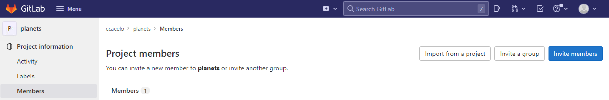
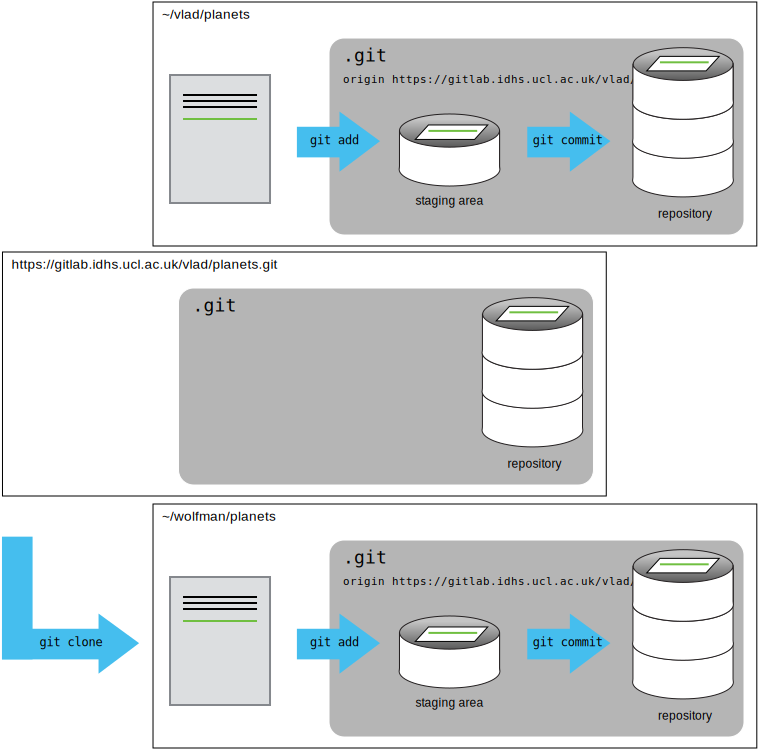

For the next step, get into pairs.  One person will be the "Owner" and the other
will be the "Maintainer". The goal is that the Maintainer will add changes into
the Owner's repository. We will switch roles at the end, so both people will
play Owner and Maintainer.

> ## Practicing By Yourself
>
> If you're working through this lesson on your own, you can carry on by opening
> a second Git Bash window.
> This window will represent your partner, working on another computer. You
> won't need to give anyone access in GitLab, because both "partners" are you.
{: .callout}

The Owner needs to give the Maintainer access. In GitLab, hover over "Project information"
in the left-hand navigation bar, then select "Members", and click the "Invite members" button 
on the top right. Unless your partner has added their real name to their GitLab profile, you will need 
to search by their DSH username.

If you give your partner anything less than the Maintainer role, e.g. "Developer", then
you will find that they get an error message when trying to complete the task set out below. 



Once the Maintainer has accepted access to the Owner's repo, she needs to download a local copy
to work on. This is called "cloning a repo". 

The Maintainer doesn't want to overwrite her own version of `planets.git`, so 
needs to clone the Owner's repository to a different location than her own 
repository with the same name.
 
To clone the Owner's repo into her `Desktop` folder, the Maintainer enters:

~~~
$ git clone git@gitlab.idhs.ucl.ac.uk:vlad/planets.git ~/Desktop/vlad-planets
~~~
{: .language-bash}

Replace 'vlad' with the Owner's username.

If you choose to clone without the clone path
(`~/Desktop/vlad-planets`) specified at the end,
you will clone inside your current working directory.



The Maintainer can now make a change in her clone of the Owner's repository,
exactly the same way as we've been doing before:

~~~
$ cd ~/Desktop/vlad-planets
$ nano pluto.txt
$ cat pluto.txt
~~~
{: .language-bash}

~~~
It is so a planet!
~~~
{: .output}

~~~
$ git add pluto.txt
$ git commit -m "Add notes about Pluto"
~~~
{: .language-bash}

~~~
 1 file changed, 1 insertion(+)
 create mode 100644 pluto.txt
~~~
{: .output}

Then push the change to the *Owner's repository* on GitHub:

~~~
$ git push origin main
~~~
{: .language-bash}

~~~
Enumerating objects: 4, done.
Counting objects: 4, done.
Delta compression using up to 4 threads.
Compressing objects: 100% (2/2), done.
Writing objects: 100% (3/3), 306 bytes, done.
Total 3 (delta 0), reused 0 (delta 0)
To https://gitlab.idhs.ucl.ac.uk/vlad/planets.git
   9272da5..29aba7c  main -> main
~~~
{: .output}

Note that we didn't have to create a remote called `origin`: Git uses this
name by default when we clone a repository.  (This is why `origin` was a
sensible choice earlier when we were setting up remotes by hand.)

Take a look at the Owner’s repository on GitLab again, and you should be 
able to see the new commit made by the Collaborator. You may need to refresh
your browser to see the new commit.

> ## Some more about remotes
>
> In this episode and the previous one, our local repository has had
> a single "remote", called `origin`. A remote is a copy of the repository
> that is hosted somewhere else, that we can push to and pull from, and 
> there's no reason that you have to work with only one. For example, 
> on some large projects you might have your own copy in your own GitHub
> account (you'd probably call this `origin`) and also the main "upstream"
> project repository (let's call this `upstream` for the sake of examples).
> You would pull from `upstream` from time to 
> time to get the latest updates that other people have committed.
>
> Remember that the name you give to a remote only exists locally. It's
> an alias that you choose - whether `origin`, or `upstream`, or `fred` -
> and not something intrinstic to the remote repository.
>
> The `git remote` family of commands is used to set up and alter the remotes
> associated with a repository. Here are some of the most useful ones:
>
> * `git remote -v` lists all the remotes that are configured (we already used
> this in the last episode)
> * `git remote add [name] [url]` is used to add a new remote
> * `git remote remove [name]` removes a remote. Note that it doesn't affect the 
> remote repository at all - it just removes the link to it from the local repo.
> * `git remote set-url [name] [newurl]` changes the URL that is associated 
> with the remote. This is useful if it has moved, e.g. to a different GitHub
> account, or from GitHub to a different hosting service. Or, if we made a typo when
> adding it!
> * `git remote rename [oldname] [newname]` changes the local alias by which a remote 
> is known - its name. For example, one could use this to change `upstream` to `fred`.
{: .callout}

To download the Collaborator's changes from GitLab, the Owner now enters:

~~~
$ git pull origin main
~~~
{: .language-bash}

~~~
remote: Enumerating objects: 4, done.
remote: Counting objects: 100% (4/4), done.
remote: Compressing objects: 100% (2/2), done.
remote: Total 3 (delta 0), reused 3 (delta 0), pack-reused 0
Unpacking objects: 100% (3/3), done.
From https://gitlab.idhs.ucl.ac.uk/vlad/planets
 * branch            main     -> FETCH_HEAD
   9272da5..29aba7c  main     -> origin/main
Updating 9272da5..29aba7c
Fast-forward
 pluto.txt | 1 +
 1 file changed, 1 insertion(+)
 create mode 100644 pluto.txt
~~~
{: .output}

Now the three repositories (Owner's local, Maintainer's local, and Owner's on
GitHub) are back in sync.

> ## A Basic Collaborative Workflow
>
> In practice, it is good to be sure that you have an updated version of the
> repository you are collaborating on, so you should `git pull` before making
> our changes. The basic collaborative workflow would be:
>
> * update your local repo with `git pull origin main`,
> * make your changes and stage them with `git add`,
> * commit your changes with `git commit -m`, and
> * upload the changes to GitLab with `git push origin main`
>
> It is better to make many commits with smaller changes rather than
> of one commit with massive changes: small commits are easier to
> read and review.
{: .callout}

> ## Switch Roles and Repeat
>
> Switch roles and repeat the whole process.
{: .challenge}

> ## Review Changes
>
> The Owner pushed commits to the repository without giving any information
> to the Maintainer. How can the Maintainer find out what has changed with
> command line? And on GitHub?
>
> > ## Solution
> > On the command line, the Maintainer can use ```git fetch origin main```
> > to get the remote changes into the local repository, but without merging
> > them. Then by running ```git diff main origin/main``` the Maintainer
> > will see the changes output in the terminal.
> >
> > On GitLab, the Maintainer can go to the repository and click on 
> > "History" to view the most recent commits pushed to the repository.
> {: .solution}
{: .challenge}

> ## Comment Changes in GitLab
>
> The Maintainer has some questions about one line change made by the Owner and
> has some suggestions to propose.
>
> With GitLab, it is possible to comment on the diff of a commit. Over the line of
> code to comment, a blue comment icon appears to open a comment window.
>
> The Maintainer posts her comments and suggestions using the GitLab interface.
{: .challenge}

> ## Version History, Backup, and Version Control
>
> Some backup software can keep a history of the versions of your files. They also
> allows you to recover specific versions. How is this functionality different from version control?
> What are some of the benefits of using version control, Git and GitLab?
{: .challenge}
